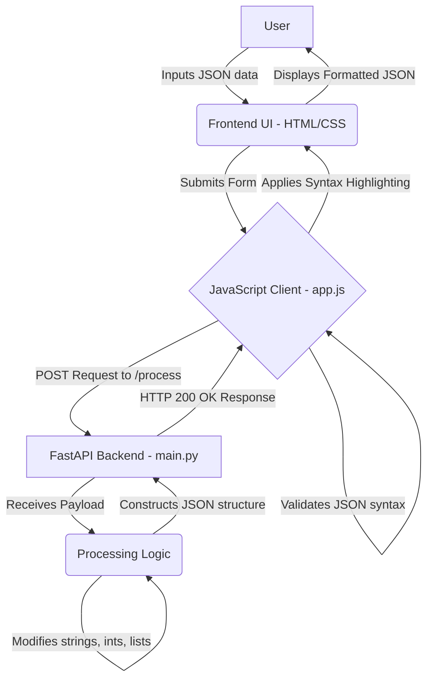
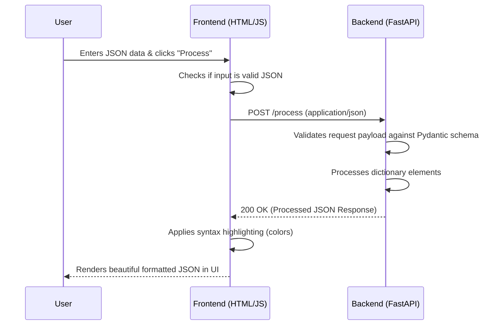

# JSON Processor Web App

A lightweight, modern web application that processes JSON payloads. It features a beautiful, glassmorphism-styled UI on the frontend and a fast, asynchronous Python backend powered by FastAPI.

## Architecture Flowchart



## Request Lifecycle



## Running Locally

### Prerequisites
- Python 3.8 or higher

### Setup

1. **Activate the virtual environment:**
   ```bash
   source venv/bin/activate
   ```

2. **Install the dependencies:**
   ```bash
   pip install -r requirements.txt
   ```

3. **Start the FastAPI server:**
   ```bash
   uvicorn main:app --reload
   ```

4. **Access the application:**
   Open your browser and navigate to [http://127.0.0.1:8000/](http://127.0.0.1:8000/)
